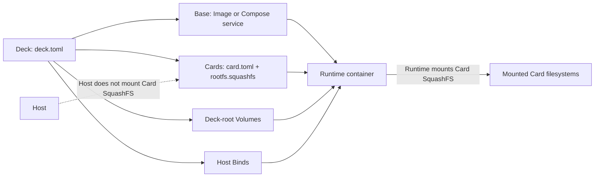

# Dembly

English documentation: [README.md](README.md)

## 言語

[English](README.md) | 日本語

## 概要

Dembly は、Docker/OCI Base、不変の SquashFS Card、Deck ルートのストレージ宣言から Linux 開発 Runtime を作成します。
Deck は、Base、Card、Volume、Bind mount、環境変数を宣言する `deck.toml` ファイルです。
Dembly は Linux x86_64 向けに配布されており、利用にこのリポジトリーの clone やソースからのビルドは不要です。

## セキュリティ上の警告

Runtime は Card の SquashFS ファイルを mount するために特権付きで実行されます。
すべての Card を信頼済みコードとして扱ってください。
Card の root hook は Runtime 内で root として実行されます。
Host Bind は宣言された mode に従ってホストのファイルを公開します。
Dembly は信頼できない Card 用の sandbox を提供しません。
信頼できない Card、root hook、Host Bind を Dembly とともに使用しないでください。

## インストール

必要条件は Linux x86_64、daemon が稼働中の Docker Engine、Docker Compose v2 です。
最新版をインストールします。

```sh
curl -fsSL https://github.com/taturou/dembly/releases/latest/download/dembly-install.sh | bash
```

または、固定したリリースバージョンをインストールします。

```sh
curl -fsSL https://github.com/taturou/dembly/releases/download/v1.2.3/dembly-install.sh | bash
```

インストーラーはダウンロードしたリリース tarball を公開済み SHA-256 ファイルと照合し、リリースを `${XDG_DATA_HOME:-$HOME/.local/share}/dembly/releases` に保存します。
インストーラーは `~/.local/bin/dembly` を選択したバージョンへ更新します。
`~/.local/bin` が `PATH` に含まれるようにしてから、インストール済み CLI を確認します。

```sh
dembly --version
```

## Compose クイックスタート

ディレクトリーを作成し、利用者が記述した [compose.yaml](https://github.com/taturou/dembly/blob/main/examples/compose-base/compose.yaml) と [deck.toml](https://github.com/taturou/dembly/blob/main/examples/compose-base/deck.toml) をダウンロードします。

```sh
mkdir dembly-compose-base
cd dembly-compose-base
curl -fsSLO https://raw.githubusercontent.com/taturou/dembly/main/examples/compose-base/compose.yaml
curl -fsSLO https://raw.githubusercontent.com/taturou/dembly/main/examples/compose-base/deck.toml
docker compose pull
dembly validate
dembly lock
dembly up
dembly exec -- /bin/echo compose-runtime
# Optional interactive shell:
dembly exec -- /bin/sh
dembly down
```

`up` と `down` は、この Deck の `compose.yaml` をルートとする Compose project の全 service にだけ影響します（project 名は `dembly-<deck-name>` です）。
ホスト上の無関係な Docker container には影響しません。

## アーキテクチャ



Host は各 Card の SquashFS ファイルを container 内へ渡すだけです。
特権付き Runtime がそれを mount し、Card export と hook を適用してから設定済みの process を開始します。

## 基本概念

- **Deck:** ルート設定です。
  相対 path は `deck.toml` を含むディレクトリーから解決されます。
  Dembly は親ディレクトリーを探索しません。
- **Base:** container image または Compose file から選択した service です。
- **Card:** `card.toml` manifest を持つ不変の `rootfs.squashfs` です。
  manifest の target に従って Runtime 内へ mount されます。
- **Volume:** Docker named volume ではない、Deck ルート配下の永続的な host-directory storage です。
  Deck 専用 storage は `volumes/<name>` です。
  Card 専用 storage は `volumes/<card>/<name>` です。
  `shared = true` は `volumes/<name>` を使用します。
- **Bind:** Runtime 内へ mount する host path です。
  source は `${HOST_HOME}` と `${DECK_ROOT}` をサポートします。
  target は `${USER}` と `${HOME}` をサポートします。
  `required` の既定値は `true` です。
  存在しない optional source は警告されて skip されます。
- **Lock:** `deck.lock` は、該当する場合に Base identity と Compose file checksum、および Card manifest と filesystem checksum を記録します。
  `up`、`run`、`check` は、存在しないか古い lock を拒否します。

## Base の種類

| Base | ライフサイクル | 使用する場面 |
| --- | --- | --- |
| Image | `up` は一つの `dembly-<deck-name>` Runtime container を作成して開始し、`exec` はその中へ入り、`down` は所有権を検証して削除し、`run` は一つの command 用の一時 Runtime を作成して後始末します。 | 一つの image が完全な service boundary である場合 |
| Compose | `up` は選択した service 用の生成済み override を書き込み、その後 Deck ルートの project に対して Compose を実行してその project で宣言された他の service も開始し、`exec` は選択した service を対象にし、`down` は同じ Compose file と project を使って project を停止して生成済み metadata を削除し、`run` はそのライフサイクルを通して選択した service command を実行します。 | Runtime が複数 service の Compose topology を保持する必要がある場合 |

## Card

Card ディレクトリーには `card.toml` と `rootfs.squashfs` が含まれます。
実在する非対話的な値で tool root から Card を一つビルドします。

```sh
dembly card build /opt/clang ./cards \
  --name clang --version 20.1.0 \
  --mount-target /opt/dembly/cards/clang \
  --path-prepend bin --non-interactive
```

`--non-interactive` を指定しない場合、Dembly は Card 名、version、mount target を対話的に要求します。
可能な場合には name と mount-target の既定値を提示します。
builder は SquashFS artifact を作成し、その checksum を `card.toml` に記録します。
`validate` と `lock` はそれを検証し、`up`、`run`、`check` は使用前に再度検証します。

## Deck 設定

必要に応じて、以下の独立した snippet を `deck.toml` に使用します。

### Card

```toml
[[cards]]
path = "cards/clang/card.toml"
```

### Volume

```toml
[[volumes]]
name = "build"
target = "/workspace/build"
shared = false
```

### Bind

```toml
[[binds]]
source = "${DECK_ROOT}"
target = "/workspace"
mode = "rw"
required = true
```

### 環境変数

```toml
[environment]
RUST_BACKTRACE = "1"

[environment_path]
prepend = ["/workspace/bin"]
```

### Lock

```sh
dembly lock
```

Base、選択した Compose service、Compose file、Card artifact を変更した後に `lock` を実行します。
この操作は `deck.lock` を書き換えます。
`up`、`run`、`check` は古い lock を拒否します。

### 完全な Compose Base template

すべての `<replace-me>` の値を置き換え、`compose.yaml` をこの `deck.toml` の隣に置きます。

```toml
schema_version = 1
name = "<replace-me>"

[base]
compose = "compose.yaml"
service = "<replace-me>"

[[cards]]
path = "cards/<replace-me>/card.toml"

[environment]
EXAMPLE_VARIABLE = "<replace-me>"

[[volumes]]
name = "<replace-me>"
target = "/<replace-me>"
shared = false

[[binds]]
source = "${DECK_ROOT}/<replace-me>"
target = "/<replace-me>"
mode = "rw"
required = true
```

## CLI リファレンス

すべての Deck 引数は `deck.toml` への任意の path です。
引数がない場合、current directory に `deck.toml` が必要です。

| Command | 効果 | 失敗条件 |
| --- | --- | --- |
| `dembly --version` | 接頭辞なしのインストール済み package version を表示します。 | executable を開始できない場合 |
| `dembly validate [deck.toml]` | Runtime を作成せずに Deck と Card filesystem を解決して検証します。 | Deck、path、宣言、Card checksum が不正な場合 |
| `dembly lock [deck.toml]` | 現在の image/Compose と Card identity を含む `deck.lock` を書き込みます。 | Docker が Base を inspect できない、Compose service が不正、または Card が不正な場合 |
| `dembly up [deck.toml]` | 永続的な Runtime state を作成し、Image Runtime または Deck ルートの Compose project を開始します。 | lock が存在しないか古い、Runtime がすでに存在する、Docker が失敗する、または Base に startup command がない場合 |
| `dembly down [deck.toml]` | Dembly 所有の Runtime だけを停止し、Compose では Deck ルートの project を teardown して生成済み metadata を削除します。 | Runtime metadata または ownership label がないか不正、または Docker/Compose が失敗する場合 |
| `dembly run [deck.toml] -- <command...>` | 一時 Runtime 内で一つの command を実行し、その後に一時 Runtime state を削除します。 | `-- <command...>` がない、lock が存在しないか古い、または Runtime の開始が失敗する場合 |
| `dembly exec [deck.toml] -- <command...>` | すでに実行中の Runtime 内で一つの command を実行します。 | `-- <command...>` がない、所有する Runtime が実行されていない、Runtime metadata を読み取れない、または command 実行が失敗する場合 |
| `dembly inspect [deck.toml]` | 解決済みの Deck plan を表示します。 | Deck を解決できない場合 |
| `dembly check [deck.toml]` | 設定済みの各 Card check を実行し、Compose check はその project を一時的に開始して停止します。 | lock が存在しないか古い、Runtime setup が失敗する、またはいずれかの Card check が失敗する場合 |
| `dembly card build <tool-root> <cards-root> [options]` | `<cards-root>` 配下に Card artifact をビルドし、option は `--name`、`--version`、`--mount-target`、繰り返し指定できる `--path-prepend`、`--non-interactive` です。 | 必須引数または非対話 metadata がない、`mksquashfs` が失敗する、または output を書き込めない場合 |
| `dembly help` | 公開 command list を表示します。 | 通常の失敗条件はありません |

## 開発

ソース開発では [mise](https://mise.jdx.dev/) とリポジトリーで設定された Rust toolchain を使用します。
開発時だけリポジトリーを clone し、次を実行します。

```sh
./scripts/setup-dev.sh
mise run install
mise exec -- cargo fmt --check
mise exec -- cargo clippy --locked --all-targets --all-features -- -D warnings
mise exec -- cargo test --locked
./scripts/check-linux.sh
mise exec -- cargo build --locked --release --target x86_64-unknown-linux-musl -p dembly-cli
```

`scripts/check-linux.sh` は Docker、Compose、SquashFS support、必要な host tool を含む完全な Linux 開発環境を検査します。

## 制限と評価

Dembly は現在、Linux x86_64 と `x86_64-unknown-linux-musl` のリリース binary をサポートします。
Card の mount には特権実行が必要なため、rootless Docker はサポート対象の Runtime model 外です。
以下の layout は測定値ではなく、artifact organization の例です。

| Case | Conventional layout | Dembly artifact layout |
| --- | --- | --- |
| Base | `base-image` | `base-image` |
| Base + ATfEP | `base-image-with-atfep` | `base-image` + `cards/atfep/rootfs.squashfs` |
| Base + Clang | `base-image-with-clang` | `base-image` + `cards/clang/rootfs.squashfs` |
| Base + ATfEP + TIS | `base-image-with-atfep-and-tis` | `base-image` + `cards/atfep/rootfs.squashfs` + `cards/tis/rootfs.squashfs` |

## ライセンス

[LICENSE](LICENSE) を参照してください。
ソースは閲覧と GitHub 上での fork のために公開されています。
コピー、改変、再配布、商用利用には著作権者の事前の書面による許可が必要です。
