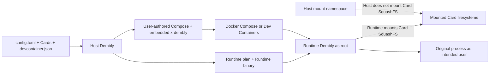

# Dembly

English documentation: [README.md](README.md)

## 言語

[English](README.md) | 日本語

## 概要

Dembly は、利用者が記述した Docker Compose project、不変の SquashFS Card、`.dembly/config.toml` から Linux 開発環境を構成します。
Host Dembly は入力を検証し、解決済み Lock と適用状態をトップレベルの `x-dembly` へ保存して、選択 service の管理 field だけを更新します。
container の lifecycle は native Docker Compose と任意の VS Code Dev Containers が管理します。
Dembly は Linux x86_64 向けに配布されており、利用時にこのリポジトリーの clone やソースからの build は不要です。

## セキュリティ上の警告

選択した Runtime service は、Runtime Dembly が kernel を使って Card の SquashFS を mount するため、特権付きで動作します。
Runtime Dembly と Card の post-mount hook は root で動作し、その後に元の process が指定利用者として起動します。
すべての Card と hook を信頼済みコードとして扱い、各 Host Bind の source と mode を確認してください。
Dembly は信頼できない Card、hook、Host Bind を隔離しません。

## インストール

必要条件は Linux x86_64、接続可能な daemon を持つ Docker Engine、Docker Compose v2 plugin です。
Runtime の起動には、特権 container を作成する権限、Host の loop device、SquashFS support も必要です。
最新版をインストールします。

```sh
curl -fsSL https://github.com/taturou/dembly/releases/latest/download/dembly-install.sh | bash
```

または、固定したリリースバージョンをインストールします。

```sh
curl -fsSL https://github.com/taturou/dembly/releases/download/v1.2.3/dembly-install.sh | bash
```

インストーラーは release archive を公開済み SHA-256 file と照合し、リリースを `${XDG_DATA_HOME:-$HOME/.local/share}/dembly/releases` に保存して、`~/.local/bin/dembly` を選択した version へ更新します。
`~/.local/bin` を `PATH` に追加してから、インストール済み CLI を確認します。

```sh
dembly --version
```

## Compose クイックスタート

次のコマンドは、生成済み設定を除いた実行可能な Compose 例をダウンロードし、`dembly init` で `.dembly/config.toml` を対話的に作成します。
prompt では検出された `.devcontainer/devcontainer.json` と、その `dev` service を採用します。

```sh
mkdir -p dembly-compose-example/.devcontainer
cd dembly-compose-example
curl -fsSLo compose.yaml https://raw.githubusercontent.com/taturou/dembly/main/examples/compose-base/compose.yaml
curl -fsSLo .devcontainer/devcontainer.json https://raw.githubusercontent.com/taturou/dembly/main/examples/compose-base/.devcontainer/devcontainer.json
curl -fsSLo .devcontainer/initialize-host.sh https://raw.githubusercontent.com/taturou/dembly/main/examples/compose-base/.devcontainer/initialize-host.sh
chmod +x .devcontainer/initialize-host.sh

docker compose -f compose.yaml pull
dembly init
dembly validate
dembly lock
dembly apply

docker compose -f compose.yaml up -d
docker compose -f compose.yaml ps
docker compose -f compose.yaml logs dev
docker compose -f compose.yaml exec --user root dev /bin/echo compose-runtime
docker compose -f compose.yaml run --rm dev /bin/echo compose-run
dembly check
docker compose -f compose.yaml run --rm dev \
  /run/dembly/bin/dembly __runtime check /run/dembly/runtime/dev.toml
docker compose -f compose.yaml down

dembly unapply
```

追跡中の例には `init` が生成した設定が含まれるため、repository checkout から実行する場合は `validate` から開始します。
すべての Docker Compose command で Dev Containers と同じ順序の `-f` 列を使用します。
トップレベルの Compose `name` を `-p` または `COMPOSE_PROJECT_NAME` で置き換える運用は Dembly の対象外です。
Dembly は実行中の container を検出も停止もしないため、`docker compose down` の後だけ `unapply` を実行します。

## アーキテクチャ



Host Dembly は設定を構成する役割だけを持ち、container の作成、起動、停止、削除、内部での command 実行を行いません。
Docker Compose は container lifecycle の唯一の公開 interface です。

## 基本概念

- **Deck**：一つの Compose service と、その Card、永続 directory、Host Bind、環境変数の宣言です。
- **Deck root**：`.dembly/` directory であり、設定の相対 path と `${DECK_ROOT}` はここから解決します。
- **Card**：`card.toml` manifest と `rootfs.squashfs` filesystem からなる不変 artifact であり、Runtime 内で mount します。
- **管理対象 Compose file**：Dembly が更新できる一つの利用者管理 file であり、有効なトップレベル `name` が必要です。
- **Lock**：`x-dembly.lock` に保存する不変の image と Card の identity であり、`dembly lock` だけが更新します。
- **適用状態**：競合検出と復元に使う初期値と前回適用値であり、`x-dembly.state` に保存します。
- **指定利用者**：適用前の service user、image user、root fallback の順で選び、元の process、Compose `run` command、通常の `exec` 作業を実行します。

## 設定

`.dembly/config.toml` は `init` による生成後も Git 管理する設定の正本です。
`--config` を省略した command は current directory の `.dembly/config.toml` だけを使用し、親 directory を探索しません。

```toml
schema_version = 1

[compose]
path = "../compose.yaml"
service = "dev"

[devcontainer]
path = "../.devcontainer/devcontainer.json"

[[cards]]
path = "/var/lib/dembly/cards/<replace-me>/card.toml"

[environment]
EXAMPLE_VARIABLE = "<replace-me>"

[environment_path]
prepend = ["/workspace/bin"]

[[volumes]]
name = "<replace-me>"
target = "/workspace/<replace-me>"
shared = false

[[binds]]
source = "${HOST_HOME}/<replace-me>"
target = "${HOME}/<replace-me>"
mode = "ro"
required = false
```

管理対象 Compose file は利用者管理の project 名と空の Dembly extension を最初から持ち、`lock` と `apply` が同じ extension を更新します。

```yaml
name: <replace-me>

x-dembly:
  schema_version: 1

services:
  dev:
    image: <replace-me>
```

Dev Containers を有効にする場合、`dockerComposeFile` の最後に管理対象 file を置き、`service` を一致させ、`overrideCommand` を false または未指定、`containerUser` を root または未指定、`remoteUser` を指定利用者にします。
Dembly は `devcontainer.json`、`initializeCommand`、利用者管理の Host 初期化 script を読み取りますが、書き換えません。

## Card

実在する tool root から、明示的な非対話 metadata を使って Card を一つ build します。

```sh
dembly card build /opt/clang /var/lib/dembly/cards \
  --name clang --version 20.1.0 \
  --mount-target /opt/dembly/cards/clang \
  --path-prepend bin --non-interactive
```

`--non-interactive` を指定しない場合、Dembly は不足する Card 名、version、mount target を要求します。
builder は `card.toml` と `rootfs.squashfs` を書き込み、filesystem の SHA-256 を表示します。
Card の変更後は `dembly lock`、`dembly apply`、同じ順序の Docker Compose `-f` 列を指定した `up -d` を再実行し、Lock digest の変更によって基礎 image の build なしで選択 container を再作成します。

## CLI リファレンス

設定 command は任意の `--config <path>` を受け付けますが、位置引数の設定 path は受け付けません。

| Command | 効果 | 主な失敗条件 |
| --- | --- | --- |
| `dembly --version` | インストール済み package version を表示します。 | executable を開始できない場合 |
| `dembly init [--config <path>]` | 固定した Card と Dev Containers の位置を対話的に探索し、初期設定を作成します。 | 出力が存在する、選択が不正、または設定を書き込めない場合 |
| `dembly validate [--config <path>]` | schema、path、checksum、Compose 解決、Dev Containers 制約、管理 field の競合を file 更新なしで検証します。 | 入力または解決した関係が不正な場合 |
| `dembly lock [--config <path>]` | 不変の image と Card identity を `x-dembly.lock` へ保存します。 | 検証、image inspect、競合検出、atomic replace が失敗する場合 |
| `dembly apply [--config <path>]` | Runtime artifact を生成し、選択 service へ管理 field を適用します。 | Lock がないか古い、管理 field が競合する、または artifact を作成できない場合 |
| `dembly unapply [--config <path>]` | 初期の管理 field を復元し、Lock と Volume を保持したまま Runtime artifact を削除します。 | 適用状態がない、管理 field が競合する、または復元が失敗する場合 |
| `dembly inspect [--config <path>]` | 解決済み Deck と変更予定を file 更新なしで表示します。 | 入力を解決または検証できない場合 |
| `dembly check [--config <path>]` | Card check を実行せず、Lock、適用状態、Runtime artifact、管理 field を検査します。 | 静的 Host 状態がない、古い、または競合する場合 |
| `dembly card build <tool-root> <cards-root> [options]` | 不変の Card artifact を build します。 | metadata、path、`mksquashfs`、hash、出力の置換が失敗する場合 |
| `dembly help` | 公開 Host command list を表示します | 通常の失敗条件はありません。 |

`dembly check` は Runtime Card check 用の native Compose command を表示します。
Runtime 初期化の失敗は Compose の非ゼロ status となり、detach 起動の失敗は `docker compose ps -a` と `docker compose logs <service>` で確認します。

## 開発

ソース開発では [mise](https://mise.jdx.dev/) とリポジトリーで設定された Rust toolchain を使用します。
開発時だけリポジトリーを clone し、次を実行します。

```sh
./scripts/setup-dev.sh
mise run install
mise exec -- cargo fmt --check
mise exec -- cargo clippy --locked --all-targets --all-features -- -D warnings
mise exec -- cargo test --locked
./scripts/check-linux.sh
mise exec -- cargo build --locked --release --target x86_64-unknown-linux-musl -p dembly-cli
```

`scripts/check-linux.sh` は Docker、Compose、特権 container の起動能力、loop device、SquashFS support、必要な Host tool を検査します。
任意の Dev Containers 検証には `devcontainer` CLI が必要です。

## リリース

`scripts/release.sh` は `HEAD` と `origin/main` が一致する変更のない `main` worktree から Linux x86_64 release を build して公開します。
通常リリースの前に、repository への書き込み権限を持つ GitHub CLI を認証します。

```sh
gh auth login
scripts/release.sh
scripts/release.sh 1.2.3
```

`--dry-run` は、一時 detached worktree で同じ検査と packaging を実行し、commit、tag、release を push しません。
`--clean <version>` は、その version の再 build 前に local archive、checksum、build-info file だけを削除します。

```sh
scripts/release.sh --dry-run
scripts/release.sh --dry-run 1.2.3-rc.1
scripts/release.sh --clean 1.2.3
```

## 制限と評価

Dembly は Linux x86_64 と `x86_64-unknown-linux-musl` の release binary をサポートします。
kernel による SquashFS mount が特権 container を必要とするため、rootless Docker は Runtime model の対象外です。
次の layout は artifact organization の例であり、測定値ではありません。

| Case | Conventional layout | Dembly artifact layout |
| --- | --- | --- |
| Base | `base-image` | `base-image` |
| Base + ATfEP | `base-image-with-atfep` | `base-image` + `cards/atfep/rootfs.squashfs` |
| Base + Clang | `base-image-with-clang` | `base-image` + `cards/clang/rootfs.squashfs` |
| Base + ATfEP + TIS | `base-image-with-atfep-and-tis` | `base-image` + `cards/atfep/rootfs.squashfs` + `cards/tis/rootfs.squashfs` |

## ライセンス

[LICENSE](LICENSE) を参照してください。
ソースは閲覧と GitHub 上の fork のために公開されており、コピー、改変、再配布、商用利用には著作権者の事前の書面による許可が必要です。
