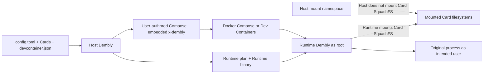

# Dembly

## Language

English | [日本語](README-ja.md)

## Overview

Dembly compiles a Linux development environment from a user-authored Docker Compose project, immutable SquashFS Cards, and `.dembly/config.toml`.
Host Dembly validates inputs, embeds the resolved Lock and apply state under top-level `x-dembly`, and updates only the selected service's managed fields.
Native Docker Compose and optional VS Code Dev Containers own the container lifecycle.
Dembly is distributed for Linux x86_64; using it does not require cloning this repository or building from source.

## Security warning

The selected Runtime service runs privileged because Runtime Dembly mounts Card SquashFS files with the kernel.
Runtime Dembly and Card post-mount hooks run as root before the original process starts as the intended user.
Treat every Card and hook as trusted code, and review every Host Bind source and mode.
Dembly does not sandbox untrusted Cards, hooks, or Host Binds.

## Installation

Requirements are Linux x86_64, Docker Engine with a reachable daemon, and the Docker Compose v2 plugin.
Starting a Runtime also requires permission to create privileged containers plus host loop-device and SquashFS support.
Install the latest release:

```sh
curl -fsSL https://github.com/taturou/dembly/releases/latest/download/dembly-install.sh | bash
```

Or install a fixed release version:

```sh
curl -fsSL https://github.com/taturou/dembly/releases/download/v1.2.3/dembly-install.sh | bash
```

The installer verifies the release archive against its published SHA-256 file, stores releases under `${XDG_DATA_HOME:-$HOME/.local/share}/dembly/releases`, and updates `~/.local/bin/dembly` to the selected version.
Ensure `~/.local/bin` is on `PATH`, then confirm the installed CLI:

```sh
dembly --version
```

## Compose Quickstart

The commands below download the runnable Compose example without its already-generated configuration, then use `dembly init` to create `.dembly/config.toml` interactively.
Accept the detected `.devcontainer/devcontainer.json` and its `dev` service when prompted.

```sh
mkdir -p dembly-compose-example/.devcontainer
cd dembly-compose-example
curl -fsSLo compose.yaml https://raw.githubusercontent.com/taturou/dembly/main/examples/compose-base/compose.yaml
curl -fsSLo .devcontainer/devcontainer.json https://raw.githubusercontent.com/taturou/dembly/main/examples/compose-base/.devcontainer/devcontainer.json
curl -fsSLo .devcontainer/initialize-host.sh https://raw.githubusercontent.com/taturou/dembly/main/examples/compose-base/.devcontainer/initialize-host.sh
chmod +x .devcontainer/initialize-host.sh

docker compose -f compose.yaml pull
dembly init
dembly validate
dembly lock
dembly apply

docker compose -f compose.yaml up -d
docker compose -f compose.yaml ps
docker compose -f compose.yaml logs dev
docker compose -f compose.yaml exec --user root dev /bin/echo compose-runtime
docker compose -f compose.yaml run --rm dev /bin/echo compose-run
dembly check
docker compose -f compose.yaml run --rm dev \
  /run/dembly/bin/dembly __runtime check /run/dembly/runtime/dev.toml
docker compose -f compose.yaml down

dembly unapply
```

The tracked example already includes the configuration produced by `init`, so start at `validate` when running it from a repository checkout.
Every Docker Compose command must use the same ordered `-f` list as Dev Containers.
Do not use `-p` or `COMPOSE_PROJECT_NAME` to replace the top-level Compose `name`; a different project name is outside Dembly's supported workflow.
Run `unapply` only after `docker compose down`, because Dembly neither detects nor stops running containers.

## Architecture



Host Dembly is a configuration compiler and does not create, start, stop, remove, or enter containers.
Docker Compose is the only public container lifecycle interface.

## Core concepts

- **Deck:** one Compose service plus its Cards, persistent directories, Host Binds, and environment declarations.
- **Deck root:** the `.dembly/` directory; configuration-relative paths and `${DECK_ROOT}` resolve from it.
- **Card:** an immutable `card.toml` manifest and `rootfs.squashfs` filesystem mounted inside the Runtime.
- **Managed Compose file:** the single user-authored Compose file that Dembly may update; it must contain a valid top-level `name`.
- **Lock:** immutable image and Card identities stored under `x-dembly.lock`; only `dembly lock` updates it.
- **Apply state:** original and last-applied values stored under `x-dembly.state` for conflict detection and restoration.
- **Intended user:** the pre-apply service user, image user, or root fallback that runs the original process, Compose `run` command, and normal `exec` work.

## Configuration

`.dembly/config.toml` is the tracked source of truth after `init` creates it.
Without `--config`, commands use only `.dembly/config.toml` in the current directory and do not search parents.

```toml
schema_version = 1

[compose]
path = "../compose.yaml"
service = "dev"

[devcontainer]
path = "../.devcontainer/devcontainer.json"

[[cards]]
path = "/var/lib/dembly/cards/<replace-me>/card.toml"

[environment]
EXAMPLE_VARIABLE = "<replace-me>"

[environment_path]
prepend = ["/workspace/bin"]

[[volumes]]
name = "<replace-me>"
target = "/workspace/<replace-me>"
shared = false

[[binds]]
source = "${HOST_HOME}/<replace-me>"
target = "${HOME}/<replace-me>"
mode = "ro"
required = false
```

The managed Compose file starts with a user-owned project name and an empty Dembly extension; `lock` and `apply` populate the extension in place.

```yaml
name: <replace-me>

x-dembly:
  schema_version: 1

services:
  dev:
    image: <replace-me>
```

If Dev Containers are enabled, `dockerComposeFile` must include the managed file last, `service` must match, `overrideCommand` must be false or absent, `containerUser` must be root or absent, and `remoteUser` must match the intended user.
Dembly reads but never rewrites `devcontainer.json`, `initializeCommand`, or its user-managed Host initialization script.

## Cards

Build one Card from an existing tool root with explicit non-interactive metadata:

```sh
dembly card build /opt/clang /var/lib/dembly/cards \
  --name clang --version 20.1.0 \
  --mount-target /opt/dembly/cards/clang \
  --path-prepend bin --non-interactive
```

Without `--non-interactive`, Dembly prompts for missing Card name, version, and mount target.
The builder writes `card.toml` and `rootfs.squashfs`, then reports the filesystem SHA-256.
After changing a Card, run `dembly lock`, `dembly apply`, and `up -d` with the same ordered Docker Compose `-f` list; the Lock digest change makes Compose recreate the selected container without rebuilding the base image.

## CLI reference

Configuration commands accept optional `--config <path>`; no positional configuration path is supported.

| Command | Effect | Important failure conditions |
| --- | --- | --- |
| `dembly --version` | Prints the installed package version. | The executable cannot start. |
| `dembly init [--config <path>]` | Interactively discovers fixed Card and Dev Containers locations and creates the initial configuration. | The output already exists, a selection is invalid, or configuration cannot be written. |
| `dembly validate [--config <path>]` | Validates schemas, paths, checksums, Compose resolution, Dev Containers constraints, and managed-field conflicts without writing. | Any input or resolved relation is invalid. |
| `dembly lock [--config <path>]` | Resolves immutable image and Card identities into `x-dembly.lock`. | Validation, image inspection, conflict detection, or atomic replacement fails. |
| `dembly apply [--config <path>]` | Writes Runtime artifacts and applies managed fields to the selected service. | The Lock is missing or stale, managed fields conflict, or artifact creation fails. |
| `dembly unapply [--config <path>]` | Restores original managed fields and removes Runtime artifacts while retaining Lock and volumes. | Apply state is absent, managed fields conflict, or restoration fails. |
| `dembly inspect [--config <path>]` | Displays the resolved Deck and proposed changes without writing. | Inputs cannot be resolved or validated. |
| `dembly check [--config <path>]` | Checks Lock, apply state, Runtime artifacts, and managed fields without running Card checks. | Static Host state is missing, stale, or conflicting. |
| `dembly card build <tool-root> <cards-root> [options]` | Builds an immutable Card artifact. | Metadata, paths, `mksquashfs`, hashing, or output replacement fails. |
| `dembly help` | Prints the public Host command list. | No normal failure condition. |

`dembly check` prints the native Compose command for Runtime Card checks.
Runtime initialization failures appear as nonzero Compose status; use `docker compose ps -a` and `docker compose logs <service>` to inspect detached startup failures.

## Development

Source development uses [mise](https://mise.jdx.dev/) and the repository's configured Rust toolchain.
Clone the repository only for development, then run:

```sh
./scripts/setup-dev.sh
mise run install
mise exec -- cargo fmt --check
mise exec -- cargo clippy --locked --all-targets --all-features -- -D warnings
mise exec -- cargo test --locked
./scripts/check-linux.sh
mise exec -- cargo build --locked --release --target x86_64-unknown-linux-musl -p dembly-cli
```

`scripts/check-linux.sh` checks Docker, Compose, privileged-container capability, loop devices, SquashFS support, and required host tools.
The optional Dev Containers validation requires the `devcontainer` CLI.

## Release

`scripts/release.sh` builds and publishes a Linux x86_64 release from a clean `main` worktree whose `HEAD` equals `origin/main`.
Authenticate GitHub CLI with repository write access before a normal release:

```sh
gh auth login
scripts/release.sh
scripts/release.sh 1.2.3
```

Use `--dry-run` to run the same gates and packaging in a temporary detached worktree without pushing commits, tags, or releases.
Use `--clean <version>` only to remove locally generated archive, checksum, and build-info files before rebuilding that version.

```sh
scripts/release.sh --dry-run
scripts/release.sh --dry-run 1.2.3-rc.1
scripts/release.sh --clean 1.2.3
```

## Limitations and evaluation

Dembly currently supports Linux x86_64 and `x86_64-unknown-linux-musl` release binaries.
Rootless Docker is outside the supported Runtime model because kernel SquashFS mounting requires a privileged container.
The layouts below illustrate artifact organization and are not measurements.

| Case | Conventional layout | Dembly artifact layout |
| --- | --- | --- |
| Base | `base-image` | `base-image` |
| Base + ATfEP | `base-image-with-atfep` | `base-image` + `cards/atfep/rootfs.squashfs` |
| Base + Clang | `base-image-with-clang` | `base-image` + `cards/clang/rootfs.squashfs` |
| Base + ATfEP + TIS | `base-image-with-atfep-and-tis` | `base-image` + `cards/atfep/rootfs.squashfs` + `cards/tis/rootfs.squashfs` |

## License

See [LICENSE](LICENSE).
The source is available for viewing and GitHub forks; copying, modification, redistribution, and commercial use require prior written permission from the copyright holder.
