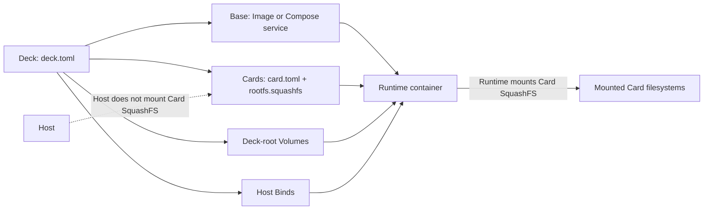

# Dembly

## Language

English | [日本語](README-ja.md)

## Overview

Dembly creates Linux development Runtimes from a Docker/OCI Base, immutable SquashFS Cards, and Deck-root storage declarations. A Deck is a `deck.toml` file that declares the Base, Cards, Volumes, Bind mounts, and environment. Dembly is distributed for Linux x86_64; using it does not require cloning this repository or building from source.

## Security warning

Runtimes run privileged so that the Runtime can mount Card SquashFS files. Treat every Card as trusted code: Card root hooks run as root inside the Runtime. Host Binds expose host files according to their declared mode. Dembly does not provide a sandbox for untrusted Cards; do not use an untrusted Card, root hook, or Host Bind with it.

## Installation

Requirements are Linux x86_64, Docker Engine with its daemon running, and Docker Compose v2. Install the latest release:

```sh
curl -fsSL https://github.com/taturou/dembly/releases/latest/download/dembly-install.sh | bash
```

Or install a fixed release version:

```sh
curl -fsSL https://github.com/taturou/dembly/releases/download/v1.2.3/dembly-install.sh | bash
```

The installer verifies the downloaded release tarball against its published SHA-256 file, stores releases under `${XDG_DATA_HOME:-$HOME/.local/share}/dembly/releases`, and updates `~/.local/bin/dembly` to the selected version. Ensure `~/.local/bin` is on `PATH`, then confirm the installed CLI:

```sh
dembly --version
```

## Compose Quickstart

Create a directory and download the user-authored [compose.yaml](https://github.com/taturou/dembly/blob/main/examples/compose-base/compose.yaml) and [deck.toml](https://github.com/taturou/dembly/blob/main/examples/compose-base/deck.toml):

```sh
mkdir dembly-compose-base
cd dembly-compose-base
curl -fsSLO https://raw.githubusercontent.com/taturou/dembly/main/examples/compose-base/compose.yaml
curl -fsSLO https://raw.githubusercontent.com/taturou/dembly/main/examples/compose-base/deck.toml
docker compose pull
dembly validate
dembly lock
dembly up
dembly exec -- /bin/echo compose-runtime
# Optional interactive shell:
dembly exec -- /bin/sh
dembly down
```

`up` and `down` affect all services in the Compose project rooted at this Deck's `compose.yaml` (the project is named `dembly-<deck-name>`). They do not affect unrelated Docker containers on the host.

## Architecture



The host only passes each Card's SquashFS file into the container. The privileged Runtime mounts it, applies Card exports and hooks, then starts the configured process.

## Core concepts

- **Deck:** the root configuration. Relative paths resolve from the directory containing `deck.toml`; Dembly does not search parent directories.
- **Base:** the container image or the selected service from a Compose file.
- **Card:** an immutable `rootfs.squashfs` with a `card.toml` manifest, mounted at the manifest's target inside the Runtime.
- **Volume:** persistent host-directory storage under the Deck root, not a Docker named volume. Deck-private storage is `volumes/<name>`; Card-private storage is `volumes/<card>/<name>`; `shared = true` uses `volumes/<name>`.
- **Bind:** a host path mounted into the Runtime. Sources support `${HOST_HOME}` and `${DECK_ROOT}`; targets support `${USER}` and `${HOME}`. `required` defaults to `true`; a missing optional source is warned about and skipped.
- **Lock:** `deck.lock` records the Base identity and Compose file checksum when applicable, plus Card manifest and filesystem checksums. `up`, `run`, and `check` reject a missing or stale lock.

## Base types

| Base | Lifecycle | Use when |
| --- | --- | --- |
| Image | `up` creates and starts one `dembly-<deck-name>` Runtime container; `exec` enters it; `down` verifies ownership and removes it. `run` creates a temporary Runtime for one command and cleans it up. | One image is the complete service boundary. |
| Compose | `up` writes a generated override for the selected service, then runs Compose for the Deck-root project; other services declared in that project also start. `exec` targets the selected service. `down` uses the same Compose files and project to stop the project and removes generated metadata. `run` runs the selected service command through that lifecycle. | The Runtime must retain a multi-service Compose topology. |

## Cards

A Card directory contains `card.toml` and `rootfs.squashfs`. Build one from a tool root with real, non-interactive values:

```sh
dembly card build /opt/clang ./cards \
  --name clang --version 20.1.0 \
  --mount-target /opt/dembly/cards/clang \
  --path-prepend bin --non-interactive
```

Without `--non-interactive`, Dembly prompts for the Card name, version, and mount target, supplying a name and mount-target default where possible. The builder creates the SquashFS artifact and records its checksum in `card.toml`; `validate` and `lock` verify it, and `up`, `run`, and `check` verify it again before use.

## Deck configuration

Use the following independent snippets in a `deck.toml` as needed.

### Card

```toml
[[cards]]
path = "cards/clang/card.toml"
```

### Volume

```toml
[[volumes]]
name = "build"
target = "/workspace/build"
shared = false
```

### Bind

```toml
[[binds]]
source = "${DECK_ROOT}"
target = "/workspace"
mode = "rw"
required = true
```

### Environment

```toml
[environment]
RUST_BACKTRACE = "1"

[environment_path]
prepend = ["/workspace/bin"]
```

### Lock

```sh
dembly lock
```

Run `lock` after changing the Base, selected Compose service, Compose file, or Card artifacts. It rewrites `deck.lock`; `up`, `run`, and `check` reject a stale lock.

### Complete Compose Base template

Replace every `<replace-me>` value and keep `compose.yaml` beside this `deck.toml`.

```toml
schema_version = 1
name = "<replace-me>"

[base]
compose = "compose.yaml"
service = "<replace-me>"

[[cards]]
path = "cards/<replace-me>/card.toml"

[environment]
EXAMPLE_VARIABLE = "<replace-me>"

[[volumes]]
name = "<replace-me>"
target = "/<replace-me>"
shared = false

[[binds]]
source = "${DECK_ROOT}/<replace-me>"
target = "/<replace-me>"
mode = "rw"
required = true
```

## CLI reference

All Deck arguments are optional paths to `deck.toml`; without one, the current directory must contain `deck.toml`.

| Command | Effect | Fails when |
| --- | --- | --- |
| `dembly --version` | Prints the bare installed package version. | The executable cannot start. |
| `dembly validate [deck.toml]` | Resolves and validates a Deck and Card filesystems without creating a Runtime. | The Deck, paths, declarations, or Card checksums are invalid. |
| `dembly lock [deck.toml]` | Writes `deck.lock` with the current image/Compose and Card identities. | Docker cannot inspect the Base, the Compose service is invalid, or a Card is invalid. |
| `dembly up [deck.toml]` | Creates persistent Runtime state and starts the Image Runtime or Deck-root Compose project. | The lock is missing/stale, a Runtime already exists, Docker fails, or the Base has no startup command. |
| `dembly down [deck.toml]` | Stops only a Dembly-owned Runtime; for Compose, tears down its Deck-root project and removes generated metadata. | Runtime metadata or ownership labels are absent/invalid, or Docker/Compose fails. |
| `dembly run [deck.toml] -- <command...>` | Runs one command in a temporary Runtime and removes temporary Runtime state afterward. | `-- <command...>` is absent, the lock is missing/stale, or Runtime startup fails. |
| `dembly exec [deck.toml] -- <command...>` | Executes one command in the already-running Runtime. | `-- <command...>` is absent, no owned Runtime is running, Runtime metadata cannot be read, or command execution fails. |
| `dembly inspect [deck.toml]` | Prints the resolved Deck plan. | The Deck cannot be resolved. |
| `dembly check [deck.toml]` | Runs each configured Card check; Compose checks temporarily start and stop its project. | The lock is missing/stale, Runtime setup fails, or any Card check fails. |
| `dembly card build <tool-root> <cards-root> [options]` | Builds a Card artifact under `<cards-root>`. Options: `--name`, `--version`, `--mount-target`, repeatable `--path-prepend`, and `--non-interactive`. | Required arguments or non-interactive metadata are missing, `mksquashfs` fails, or output cannot be written. |
| `dembly help` | Prints the public command list. | No normal failure condition. |

## Development

Source development uses [mise](https://mise.jdx.dev/) and the repository's configured Rust toolchain. Clone the repository only for development, then run:

```sh
./scripts/setup-dev.sh
mise run install
mise exec -- cargo fmt --check
mise exec -- cargo clippy --locked --all-targets --all-features -- -D warnings
mise exec -- cargo test --locked
./scripts/check-linux.sh
mise exec -- cargo build --locked --release --target x86_64-unknown-linux-musl -p dembly-cli
```

`scripts/check-linux.sh` checks the complete Linux development environment, including Docker, Compose, SquashFS support, and required host tools.

## Limitations and evaluation

Dembly currently supports Linux x86_64 and `x86_64-unknown-linux-musl` release binaries. Rootless Docker is outside its supported Runtime model because Card mounting requires privileged execution. The layouts below are illustrative artifact organization, not measurements.

| Case | Conventional layout | Dembly artifact layout |
| --- | --- | --- |
| Base | `base-image` | `base-image` |
| Base + ATfEP | `base-image-with-atfep` | `base-image` + `cards/atfep/rootfs.squashfs` |
| Base + Clang | `base-image-with-clang` | `base-image` + `cards/clang/rootfs.squashfs` |
| Base + ATfEP + TIS | `base-image-with-atfep-and-tis` | `base-image` + `cards/atfep/rootfs.squashfs` + `cards/tis/rootfs.squashfs` |

## License

See [LICENSE](LICENSE). The source is publicly available for viewing and forking; copying, modification, redistribution, and commercial use require the copyright holder's prior written permission.
